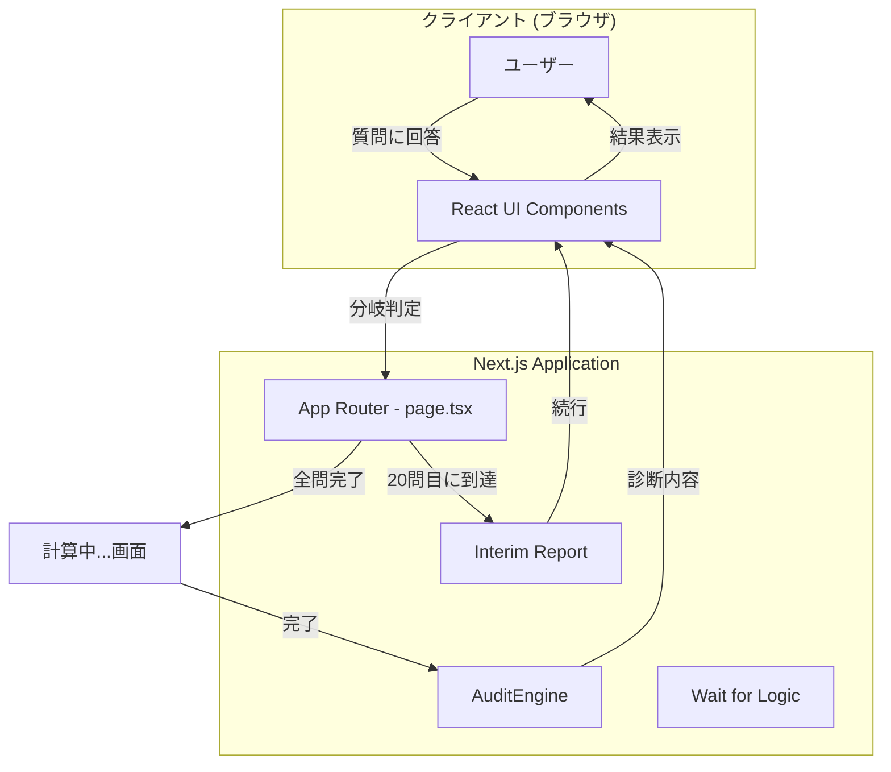
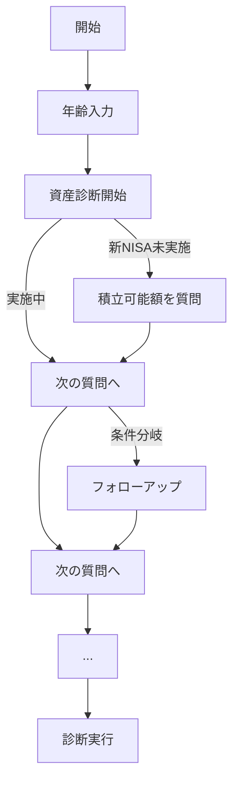

# 生涯損失診断システム (Life Audit System) 設計書 v2.3.0

## 1. システム概要

### 1.1 プロジェクト名
**Life Audit System（人生の診断システム）**

### 1.2 目的
ユーザーの「先延ばし」習慣による生涯損失額を診断し、改善アクションを提案するWebアプリケーション。
**SNS映え**を重視したビジュアルで、診断結果のシェアを促進する。

### 1.3 技術スタック

| 項目 | 技術 |
|------|------|
| フレームワーク | Next.js 14.2.4 (App Router) |
| 言語 | TypeScript 5.x |
| UIライブラリ | React 18 |
| スタイリング | Tailwind CSS 3.4.1 |
| アニメーション | Framer Motion 11.2.10 |
| アイコン | Lucide React 0.394.0 |
| スクリーンショット | html2canvas 1.4.1 |

---

## 2. システムアーキテクチャ

### 2.1 全体構成図



### 2.2 設計方針

- **ステータスバーと戻るボタン**: 進行状況の可視化と、履歴スタックによる回答のやり直し機能。
- **LocalStorage保存**: 診断の中断と再開を可能にするレジューム機能。
- **計算演出**: 安心感を与える日本語メッセージとプログレスバーによる進捗表示。
- **アクション誘導**: 改善策（パッチ）に対して、「口座開設」「予約」などの具体的なコンバージョンボタンを配置。
- **ステートレスAPI設計**: サーバーは状態を保持せず、リクエストごとに完結
- **個人情報非収集**: ユーザーデータの永続化なし、プライバシー重視
- **クライアントサイドレンダリング**: `'use client'`によるインタラクティブなUI
- **条件分岐ロジック**: ユーザーの回答に応じて次の質問を動的に決定
- **法的コンプライアンス**: 利用規約およびプライバシーポリシーの完備、フッターからのリンク設置
- **CI/CD環境**: GitHubへのプッシュをトリガーとしたVercelへの自動デプロイ

---

## 3. ディレクトリ構成

```
D:\99_Webアプリ\一生で損する金額を算出\
├── app/
│   ├── layout.tsx          # ルートレイアウト
│   ├── page.tsx            # メインページ（ウィザードUI）
│   ├── globals.css         # グローバルCSS（ネオン効果含む）
│   └── legal/
│       └── page.tsx        # 規約・プライバシーポリシー
│   └── api/
│       └── audit/
│           └── route.ts    # 診断APIエンドポイント
├── components/
│   └── ui/
│       ├── AuditReport.tsx       # 診断結果レポート（認定バッジ統合版）
│       ├── InterimReport.tsx     # 中間報告カード（20問目にのみ介入）
│       ├── ScanningAnimation.tsx # 計算中アニメーション（進捗バー付き）
│       ├── CreatorProfile.tsx    # クリエイター情報（レボーナ@ボタン設置係）
│       ├── ProgressBar.tsx       # 進捗バー
│       └── QuestionCard.tsx      # 質問カード
├── lib/
│   ├── questions.ts        # 質問データ定義（32問）
│   ├── branchingLogic.ts   # 分岐ロジック
│   └── AuditEngine.ts      # 損失計算エンジン
├── types/
│   └── audit.ts            # 型定義
├── package.json
├── tailwind.config.ts
└── tsconfig.json
```

---

## 4. データモデル設計

### 4.1 型定義 (`types/audit.ts`)

#### DisplayCategory（表示用カテゴリ）- 拡張版
```typescript
type DisplayCategory = '資産診断' | '健康診断' | 'キャリア診断' | '時間・環境診断';
```

#### AuditCategory（内部カテゴリ）
```typescript
enum AuditCategory {
  INVESTMENT = 'INVESTMENT',   // 投資・資産形成
  SAVINGS = 'SAVINGS',         // 節約・支出管理
  HEALTH = 'HEALTH',           // 健康・医療
  CAREER = 'CAREER',           // キャリア・スキル
  TIME = 'TIME',               // 時間管理
  ENVIRONMENT = 'ENVIRONMENT', // 生活環境
  RELATIONSHIP = 'RELATIONSHIP' // 人間関係
}
```

#### AuditRank（診断ランク）- NEW
```typescript
type AuditRank = 'S' | 'A' | 'B' | 'C' | 'D';

interface RankInfo {
  rank: AuditRank;
  title: string;
  color: string;
  description: string;
}
```

| ランク | 損失額閾値 | タイトル | 色 |
|--------|------------|----------|-----|
| S | 5,000万円以上 | 資産の脆弱性が深刻 | #FF0000（赤） |
| A | 3,000万円以上 | 複数の改善ポイント有 | #FF6600（オレンジ） |
| B | 1,000万円以上 | 一般的な先延ばし傾向 | #FFCC00（黄） |
| C | 500万円以上 | 軽度の改善余地あり | #00CC66（緑） |
| D | 500万円未満 | 優秀な自己管理 | #0099FF（青） |

---

## 5. 質問データ設計 (`lib/questions.ts`)

### 5.1 Question インターフェース - 拡張版

```typescript
interface Question {
  id: string;                    // 一意の質問ID
  text: string;                  // 質問文
  category: AuditCategory;       // カテゴリ
  displayCategory: DisplayCategory; // 表示用カテゴリ
  type: 'boolean' | 'number' | 'select';  // 回答タイプ（selectを追加）
  multiple?: boolean;            // 複数選択可能かどうか (true: 複数選択, false/undefined: 単一選択)
  options?: SelectOption[];      // 選択肢（type='select'の場合）
  followUp?: Question;           // フォローアップ質問
  branchCondition?: BranchCondition; // 分岐条件
  baseAmount?: number;           // 基準金額（年間）
  meta?: QuestionMeta;
}

// 質問形式:
// - 単一選択: optionsから1つのみ選択可能。選択後即座に次の質問へ遷移。`multiple`はfalseまたは未定義。
// - 複数選択: optionsから複数選択可能。選択後も遷移せず、「次へ」ボタンで確定後、次の質問へ遷移。`multiple`はtrue。

interface SelectOption {
  value: string | number;
  label: string;
  nextQuestionId?: string;  // 分岐先
}

interface BranchCondition {
  type: 'equals' | 'greaterThan' | 'lessThan';
  value: any;
  nextQuestionId: string;
}
```

### 5.2 質問一覧（全39問）
全質問は以下の4つの基本カテゴリ（各8問）に、回答に応じた深掘り質問（7問）を加えた計39問で構成される。
- **資産診断**: 投資、貯蓄、節約に関する質問。
- **健康診断**: 身体的・精神的健康に関する質問。
- **キャリア診断**: スキルアップ、転職、自己投資に関する質問。
- **時間・環境診断**: 時間管理、生活環境の最適化に関する質問。

各質問は`id`, `text`, `category`, `displayCategory`, `type`を持ち、`select`タイプの場合は`options`を持つ。`followUp`や`branchCondition`により質問の分岐ロジックが実装される。
質問の総数は基本32問＋追加7問の計39問である。

#### 【資産診断】（8問）

| ID | 質問概要 | タイプ | 分岐 |
|----|----------|--------|------|
| asset-1 | 新NISA/iDeCoの実施状況 | select | 未実施→asset-1a |
| asset-1a | 月額積立可能額 | number | - |
| asset-2 | クレカポイント活用度 | select | 未活用→asset-2a |
| asset-2a | 年間推定獲得可能ポイント | number | - |
| asset-3 | サブスク放置の有無 | boolean | はい→asset-3a |
| asset-3a | 放置サブスク月額合計 | number | - |
| asset-4 | ATM手数料の支払い頻度 | select | - |
| asset-5 | コンビニ習慣 | boolean | - |
| asset-6 | 食材廃棄頻度 | select | - |
| asset-7 | ふるさと納税の活用 | boolean | - |
| asset-8 | 保険の見直し状況 | boolean | - |

#### 【健康診断】（8問）

| ID | 質問概要 | タイプ | 分岐 |
|----|----------|--------|------|
| health-1 | 歯科検診の先延ばし期間 | select | - |
| health-2 | 平均睡眠時間 | select | 6時間未満→health-2a |
| health-2a | 睡眠不足を感じる日数 | number | - |
| health-3 | 運動習慣の有無 | select | なし→health-3a |
| health-3a | 運動しない理由 | select | - |
| health-4 | 健康診断後の再検査対応 | select | - |
| health-5 | 栄養バランスへの意識 | select | - |
| health-6 | 喫煙・飲酒習慣 | select | - |
| health-7 | メンタルヘルスケア | boolean | - |
| health-8 | 持病の治療放置 | boolean | - |

#### 【キャリア診断】（8問）

| ID | 質問概要 | タイプ | 分岐 |
|----|----------|--------|------|
| career-1 | 転職意欲の有無 | select | あり→career-1a |
| career-1a | 現職との年収差の見込み | number | - |
| career-2 | 英語学習の遅延 | select | - |
| career-3 | IT/デジタルスキル | select | - |
| career-4 | 資格取得の先延ばし | boolean | はい→career-4a |
| career-4a | 目標資格の種類 | select | - |
| career-5 | 履歴書の更新状況 | boolean | - |
| career-6 | 気乗りしない飲み会への参加 | select | - |
| career-7 | 副業・複業への取り組み | select | - |
| career-8 | 自己投資額（学習費用） | number | - |

#### 【時間・環境診断】（8問）

| ID | 質問概要 | タイプ | 分岐 |
|----|----------|--------|------|
| time-1 | 探し物に費やす時間 | select | - |
| time-2 | 古い家電の使用 | boolean | はい→time-2a |
| time-2a | 該当する家電の種類 | select | - |
| time-3 | スマホのスクリーンタイム | select | - |
| time-4 | 通勤時間の活用度 | select | - |
| time-5 | 家事の効率化 | select | - |
| time-6 | 部屋の整理整頓状況 | select | - |
| time-7 | 定型作業の自動化 | boolean | - |
| time-8 | 優先順位の付け方 | select | - |

---

## 6. 分岐ロジック設計 (`lib/branchingLogic.ts`)

### 6.1 分岐フロー



### 6.2 分岐判定関数

```typescript
function getNextQuestion(
  currentQuestion: Question,
  answer: Answer,
  allQuestions: Question[]
): Question | null {
  // 1. フォローアップ質問があるか
  if (currentQuestion.followUp && shouldShowFollowUp(currentQuestion, answer)) {
    return currentQuestion.followUp;
  }

  // 2. 分岐条件があるか
  if (currentQuestion.branchCondition) {
    const nextId = evaluateBranch(currentQuestion.branchCondition, answer);
    if (nextId) {
      return allQuestions.find(q => q.id === nextId) || null;
    }
  }

  // 3. 通常の次の質問
  const currentIndex = allQuestions.findIndex(q => q.id === currentQuestion.id);
  return allQuestions[currentIndex + 1] || null;
}
```

---

## 7. 損失計算エンジン (`lib/AuditEngine.ts`)

### 7.1 定数定義

| 定数名 | 値 | 説明 |
|--------|-----|------|
| MENTAL_COST_MULTIPLIER | 1.25 | 精神的コスト係数 |
| LIFETIME_AGE | 85 | 想定寿命 |
| DEFAULT_ANNUAL_INTEREST_RATE | 0.05 | 年利5%（複利計算用） |
| DEFAULT_HOUR_WAGE | 2,000 | デフォルト時給 |
| NISA_TAX_BENEFIT | 0.20315 | NISA非課税メリット（約20%） |

### 7.2 remainingYearsの算出ロジック
`remainingYears` は `LIFETIME_AGE` (85歳) から現在のユーザー年齢を引いた年数として算出される。これはユーザーが将来にわたって損失を被る期間を想定するためのものであり、AuditEngine内で計算される。
`remainingYears = LIFETIME_AGE - user.age`

### 7.3 カテゴリ別計算ロジック

#### 資産診断

```typescript
// 新NISA/iDeCo未実施
calculateNisaLoss(monthlyAmount: number): number {
  const futureValue = compoundInterest(monthlyAmount, this.remainingYears, 0.05);
  const taxBenefit = futureValue * 0.20315; // 運用益非課税分
  return (futureValue - monthlyAmount * 12 * this.remainingYears) + taxBenefit;
}

// クレカポイント未活用
calculatePointsLoss(annualSpending: number): number {
  const potentialPoints = annualSpending * 0.01; // 還元率1%想定
  return potentialPoints * this.remainingYears;
}
```

#### 健康診断

```typescript
// 睡眠不足による生産性低下
calculateSleepLoss(hoursShort: number, daysPerWeek: number): number {
  const productivityLoss = hoursShort * 0.25; // 1時間不足で25%低下
  const weeklyLoss = productivityLoss * daysPerWeek * this.hourWage;
  return weeklyLoss * 52 * this.remainingYears;
}

// 運動不足による医療費増加
calculateExerciseLoss(exerciseLevel: string): number {
  const riskMultiplier = {
    'none': 1.5,      // 運動なし: 医療費1.5倍
    'light': 1.2,     // 軽度: 1.2倍
    'moderate': 1.0,  // 適度: 基準
    'active': 0.8     // 活発: 0.8倍
  };
  const avgMedicalCost = 300000; // 年間平均医療費30万円
  return avgMedicalCost * (riskMultiplier[exerciseLevel] - 1) * this.remainingYears;
}
```

#### キャリア診断

```typescript
// 気乗りしない飲み会
calculateUnwantedGatheringLoss(frequency: string): number {
  const costPerEvent = 5000; // 1回あたり5,000円
  const hoursPerEvent = 3;   // 1回あたり3時間
  const frequencyMap = { 'weekly': 52, 'biweekly': 26, 'monthly': 12, 'rarely': 4 };

  const annualEvents = frequencyMap[frequency];
  const moneyCost = costPerEvent * annualEvents;
  const timeCost = hoursPerEvent * annualEvents * this.hourWage;

  return (moneyCost + timeCost) * this.remainingYears;
}
```

#### 時間・環境診断

```typescript
// スマホ過剰使用
calculateScreenTimeLoss(dailyHours: number): number {
  const productiveHours = Math.max(0, dailyHours - 2); // 2時間超過分
  const annualHours = productiveHours * 365;
  return annualHours * this.hourWage * 0.5 * this.remainingYears; // 半分を損失とみなす
}

// 古い家電の電気代
calculateOldApplianceLoss(applianceTypes: string[]): number {
  const extraCostPerType = {
    'refrigerator': 12000,  // 冷蔵庫: 年1.2万円
    'aircon': 8000,         // エアコン: 年8千円
    'washingMachine': 5000, // 洗濯機: 年5千円
    'tv': 3000              // テレビ: 年3千円
  };
  const totalExtra = applianceTypes.reduce((sum, type) => sum + (extraCostPerType[type] || 0), 0);
  return totalExtra * this.remainingYears;
}
```

### 7.4 ランク判定

```typescript
function calculateRank(totalLoss: number): RankInfo {
  if (totalLoss >= 50000000) {
    return { rank: 'S', title: '資産の脆弱性が深刻', color: '#FF0000', description: '今すぐ対策が必要です' };
  } else if (totalLoss >= 30000000) {
    return { rank: 'A', title: '複数の改善ポイント有', color: '#FF6600', description: '優先順位をつけて対策しましょう' };
  } else if (totalLoss >= 10000000) {
    return { rank: 'B', title: '一般的な先延ばし傾向', color: '#FFCC00', description: '小さな改善から始めましょう' };
  } else if (totalLoss >= 5000000) {
    return { rank: 'C', title: '軽度の改善余地あり', color: '#00CC66', description: '良好な状態です' };
  } else {
    return { rank: 'D', title: '優秀な自己管理', color: '#0099FF', description: '素晴らしい習慣です' };
  }
}
```

---

## 8. SNS映えUI設計

### 8.1 ネオンスコア表示 (`NeonScore.tsx`)

```css
/* ネオン効果のCSS */
.neon-score {
  font-size: 5rem;
  font-weight: 900;
  color: #fff;
  text-shadow:
    0 0 5px #fff,
    0 0 10px #fff,
    0 0 20px #ff0000,
    0 0 30px #ff0000,
    0 0 40px #ff0000,
    0 0 55px #ff0000,
    0 0 75px #ff0000;
  animation: neon-flicker 1.5s infinite alternate;
}

@keyframes neon-flicker {
  0%, 19%, 21%, 23%, 25%, 54%, 56%, 100% {
    text-shadow:
      0 0 5px #fff,
      0 0 10px #fff,
      0 0 20px #ff0000,
      0 0 30px #ff0000,
      0 0 40px #ff0000;
  }
  20%, 24%, 55% {
    text-shadow: none;
  }
}
```

### 8.2 グラデーション背景

```typescript
const gradientByRank = {
  'S': 'bg-gradient-to-br from-red-900 via-red-600 to-orange-500',
  'A': 'bg-gradient-to-br from-orange-900 via-orange-600 to-yellow-500',
  'B': 'bg-gradient-to-br from-yellow-900 via-yellow-600 to-green-500',
  'C': 'bg-gradient-to-br from-green-900 via-green-600 to-teal-500',
  'D': 'bg-gradient-to-br from-blue-900 via-blue-600 to-cyan-500',
};
```

### 8.3 サマリーカード仕様（画像保存用）

```typescript
interface SummaryCardProps {
  totalLoss: number;
  rank: RankInfo;
  lossAnalogy: string;
  topRiskCategories: string[];
  remainingYears: number;
}
```

**デザイン要素:**
- サイズ: 1080x1350px（Instagram推奨）
- 背景: ランク別グラデーション
- メインスコア: ネオンフォント、中央配置
- ランクバッジ: 左上に配置、光沢効果
- アナロジー: 下部にアイコン付きで表示
- ハッシュタグ: 最下部に配置
- QRコード: 右下に小さく配置

### 8.4 フローティングSNSバー

`FloatingSnsBar.tsx`コンポーネントは、診断結果ページに表示されるフローティング要素で、X (Twitter), LINE, Facebook, Threads, および画像保存（Instagram向け）の機能を提供する。

```typescript
interface FloatingSnsBarProps {
  isVisible: boolean;
  shareText: string;        // シェアするテキスト
  shareUrl: string;         // シェアするURL
  onSaveImage: () => void;  // 画像保存ハンドラ
}
```

**デザイン:**
- 位置: 画面下部固定（bottom: 20px）
- 形状: ピル型（rounded-full）
- 背景: ブラー効果 + 半透明
- アイコン: 各SNSブランドカラー
- アニメーション: スライドイン（下から）

**レイアウト（5ボタン）:**
```
[X] [LINE] [FB] [Threads] [📷保存]
```

**SNSシェアリンクの仕様:**
- **X (Twitter)**: `https://twitter.com/intent/tweet?text={shareText}&url={shareUrl}`
- **LINE**: `https://social-plugins.line.me/lineit/share?url={shareUrl}&text={shareText}`
- **Facebook**: `https://www.facebook.com/sharer/sharer.php?u={shareUrl}`
- **Threads**: `https://www.threads.net/intent/post?text={shareText}&url={shareUrl}`

**画像保存機能（Instagram向け）:**
`html2canvas` を使用して、診断結果のSummaryCardコンポーネントを画像としてキャプチャし、ユーザーにダウンロードさせる。これにより、Instagramで直接シェアできない診断結果を画像として投稿できるようにする。

---

## 9. 算出根拠（Reasoning）の視覚化

### 9.1 ReasoningBox コンポーネント

```typescript
interface ReasoningBoxProps {
  formula: string;           // 計算式
  explanation: string;       // 説明
  coefficients: Coefficient[]; // 使用係数
  result: number;            // 計算結果
}

interface Coefficient {
  name: string;
  value: number | string;
  source: string; // 根拠の出典
}
```

### 9.2 デザイン仕様

Reasoningセクションは、文字化けを解消し、背景色を`dark-slate`調に変更し、数式部分にはMonospaceフォントを適用することで視認性を向上させる。

**使用フォント:**
- **Orbitron**: タイトル、カテゴリ名、装飾テキストに使用（未来的・サイバーパンクな演出）。
- **Roboto Mono**: 金額、数値、計算式に使用（視認性と精密感の向上）。

```css
.reasoning-box {
  background: linear-gradient(135deg, #1a1a2e 0%, #16213e 100%); /* dark-slate風の背景 */
  border: 1px solid #0f3460;
  border-radius: 12px;
  padding: 20px;
  font-family: 'Orbitron', sans-serif; /* タイトル等 */
  color: #e0e0e0; /* 明るいテキスト色 */
}

.formula-display {
  background: #0d1117; /* より暗い背景で数式を際立たせる */
  border: 1px solid #30363d;
  border-radius: 8px;
  padding: 16px;
  font-family: 'Roboto Mono', monospace; /* 数式・数値にはRoboto Monoを適用 */
  color: #58a6ff; /* 数式の色 */
  overflow-x: auto;
  white-space: pre-wrap; /* 文字化け対策: pre-wrapで改行とスペースを保持 */
  word-break: break-all; /* 長い文字列の改行 */
}

.coefficient-tag {
  display: inline-flex;
  align-items: center;
  background: rgba(88, 166, 255, 0.1);
  border: 1px solid rgba(88, 166, 255, 0.3);
  border-radius: 4px;
  padding: 4px 8px;
  font-size: 12px;
  color: #58a6ff;
}
```

### 9.3 数値ハイライト

```typescript
function highlightNumbers(text: string): React.ReactNode {
  const pattern = /(\d{1,3}(?:,\d{3})*(?:\.\d+)?(?:%|円|年|時間|倍|万)?)/g;
  const parts = text.split(pattern);

  return parts.map((part, i) => {
    if (pattern.test(part)) {
      return <span key={i} className="text-cyan-400 font-bold">{part}</span>;
    }
    return part;
  });
}
```

---

## 10. API設計

### 10.1 POST /api/audit

#### リクエスト
```typescript
{
  items: AuditItemInput[];
  profile: UserProfile;
  answeredQuestions: string[]; // 回答済み質問ID
}
```

#### レスポンス（成功時）
```typescript
{
  totalFinancialLoss: number;
  totalTimeLossHours: number;
  breakdown: AuditItemResult[];
  rank: RankInfo;
  lossAnalogy: string;
  lossAnalogies: LossAnalogy[]; // 複数のアナロジー
  recommendedPatches: RecommendedPatch[];
  remainingYears: number;
  categoryBreakdown: CategoryBreakdown[];
}

interface LossAnalogy {
  icon: string;
  text: string;
  value: number;
}

interface CategoryBreakdown {
  category: DisplayCategory;
  loss: number;
  percentage: number;
}
```

---

## 11. 更新履歴

| 日付 | バージョン | 内容 |
|------|------------|------|
| 2024-XX-XX | 1.0.0 | 初版作成 |
| 2024-XX-XX | 1.1.0 | 算出根拠表示、マルチSNS連携、年齢バリデーション追加 |
| 2024-XX-XX | 1.2.0 | Facebook/Threads連携追加、シェア文言統一 |
| 2024-XX-XX | 1.3.0 | 精神的コスト係数の根拠明文化、広告UI強化 |
| 2026-02-09 | 2.0.0 | 質問数32問に拡充、分岐ロジック導入、SNS映えUI刷新、ランクシステム追加、SNS連携機能の詳細化、remainingYears算出ロジック明文化、ReasoningUI改善仕様追加 |
| 2026-02-09 | 2.1.0 | 中間報告機能（InterimReport）追加、質問数を実態に合わせ39問に更新、クリエイタープロフ情報を最新化、フォント戦略（Orbitron/Roboto Mono）の明文化 |
| 2026-02-09 | 2.2.0 | 中間報告の頻度を20問目のみに調整、計算中アニメーションを日本語＋進捗バーに簡略化（ウィルス懸念の払拭） |
| 2026-02-09 | 2.3.0 | 本番デプロイ（Vercel/GitHub）完了。リーガルページ（規約・プライバシーポリシー）追加。ホーム画面UI刷新（日本語タイトル強調、ボタン色変更） |

---

## 12. デプロイ・運用環境

### 12.1 インフラ構成
- **ホスティング**: [Vercel](https://vercel.com/) (Hobby Plan)
- **ソース管理**: [GitHub](https://github.com/pokkori/life-audit-system)
- **デプロイフロー**: `main` ブランチへのプッシュにより、VercelがGitHubのWebhookを検知し、自動的にビルドおよびデプロイを実行。

### 12.2 SNS・ブランド統合
- **Xアカウント**: `@levona_design`
- **OGPイメージ**: `/public/ogp.png` (実装予定)
- **ブランド名**: レボーナ@ボタン設置係
```